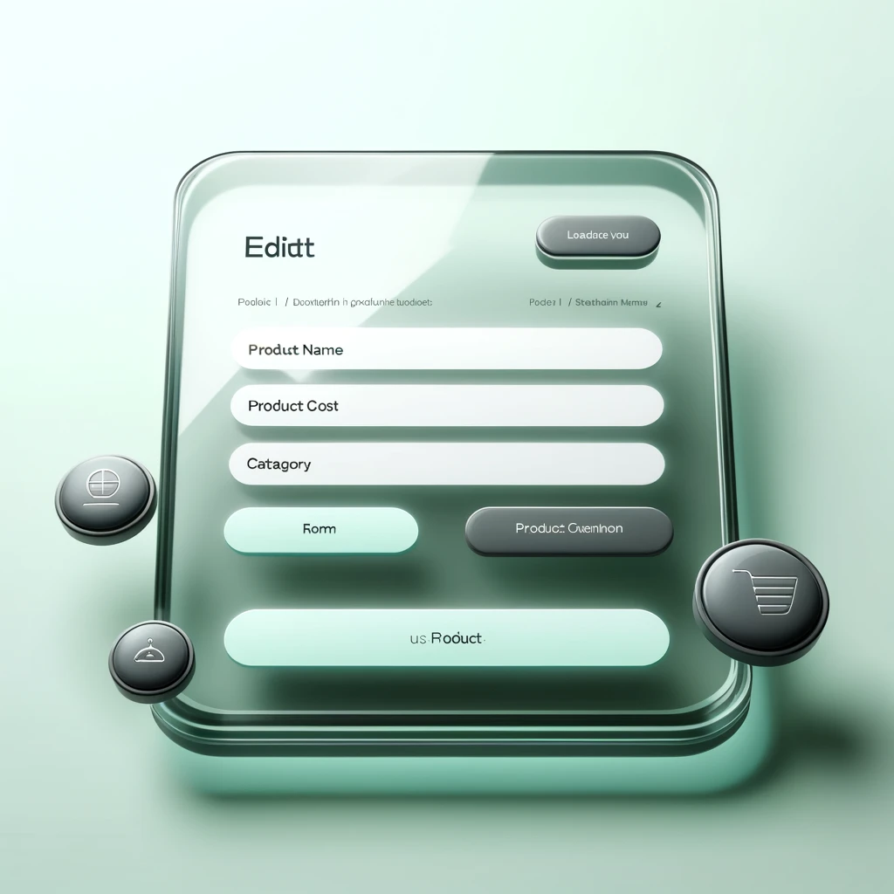
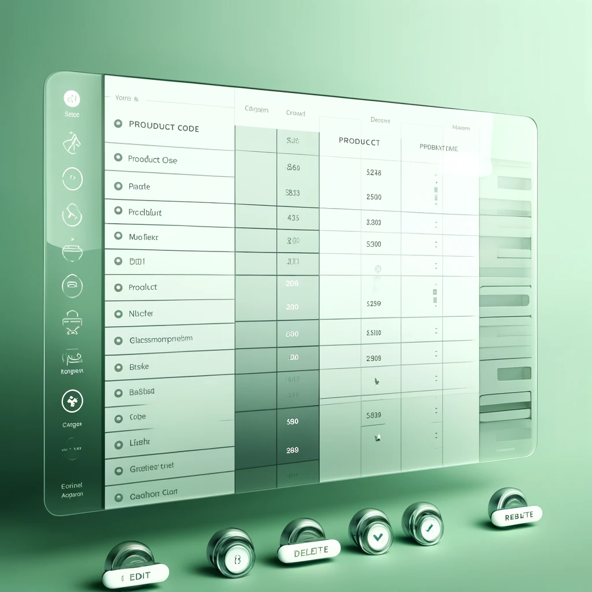

# <span style="color:#32cd32">상품 관리 시스템</span>

## <span style="color:#32cd32">개요</span>

이 프로젝트는 **Spring Boot**와 **Thymeleaf**를 사용하여 구축된 간단한 상품 관리 시스템입니다. 사용자는 상품을 **추가**, **수정**, **조회** 및 **삭제**할 수 있습니다.

## <span style="color:#32cd32">주요 기능</span>

- **<span style="color:#32cd32">상품 추가</span>**: 상품명, 가격, 종류 등의 세부 정보를 입력하여 새로운 상품을 추가할 수 있습니다.
- **<span style="color:#32cd32">상품 수정</span>**: 기존 상품의 세부 정보를 수정할 수 있습니다.
- **<span style="color:#32cd32">상품 조회</span>**: 모든 상품 목록을 조회할 수 있습니다.
- **<span style="color:#32cd32">상품 삭제</span>**: 상품을 목록에서 삭제할 수 있습니다.

## <span style="color:#32cd32">기술 스택</span>

- **백엔드**: Spring Boot, Spring Data JPA
- **프론트엔드**: Thymeleaf, HTML, CSS
- **데이터베이스**: MySQL
- **빌드 도구**: Maven

## <span style="color:#32cd32">설치 방법</span>

1. 리포지토리를 클론합니다:
    ```bash
    git clone https://github.com/ohjaoh/Spring-Practice.git
    cd Spring-Practice
    ```

2. 데이터베이스를 설정합니다:
    - MySQL이 설치되고 실행 중인지 확인합니다.
    - `testdb`라는 데이터베이스를 생성합니다.
    - 데이터베이스 자격 증명을 `application.properties` 파일에 업데이트합니다.

3. 프로젝트를 빌드합니다:
    ```bash
    mvn clean install
    ```

4. 애플리케이션을 실행합니다:
    ```bash
    mvn spring-boot:run
    ```

## <span style="color:#32cd32">사용 방법</span>

1. 웹 브라우저를 열고 `http://localhost:8012`로 이동합니다.
2. 네비게이션 버튼을 사용하여 상품을 **추가**, **조회**, **수정** 또는 **삭제**할 수 있습니다.

## <span style="color:#32cd32">디자인</span>

이 애플리케이션은 현대적이고 매력적인 사용자 인터페이스를 만들기 위해 **글래스모피즘**과 **뉴모피즘** 디자인 원칙을 사용합니다.

### <span style="color:#32cd32">주요 페이지</span>

#### <span style="color:#32cd32">상품 추가 페이지</span>

- 밝은 연두색 테마와 글래스모피즘 효과가 적용된 배경
- 반투명한 입력 필드와 선택 상자
- 호버 시 색상이 변하는 반투명한 버튼

#### <span style="color:#32cd32">상품 수정 페이지</span>

- 상품 추가 페이지와 동일한 스타일 적용
- 입력 필드의 값을 소수점 없이 '원' 단위로 표시

#### <span style="color:#32cd32">상품 목록 페이지</span>

- 짝수 행과 홀수 행에 서로 다른 연두색 배경
- 수정 및 삭제 버튼을 뉴모피즘 스타일로 디자인

## <span style="color:#32cd32">예시 화면</span>

### 상품 추가 페이지


### 상품 수정 페이지


### 상품 목록 페이지


## <span style="color:#32cd32">주의 사항</span>

- HTML 파일을 수정할 때는 항상 최신의 코드를 반영하고 브라우저 캐시를 무시하도록 설정해야 합니다.
- `application.properties` 파일을 적절히 설정하고 필요 시 `persistence.xml` 파일로 데이터베이스 설정을 이동할 수 있습니다.

이 README.md 파일은 프로젝트의 주요 정보를 제공하고 설치 및 사용 방법을 안내합니다. 프로젝트의 디자인에 대한 설명과 예시 화면도 포함되어 있습니다.
